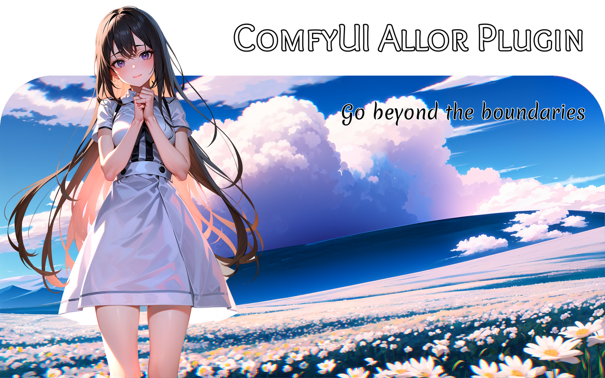
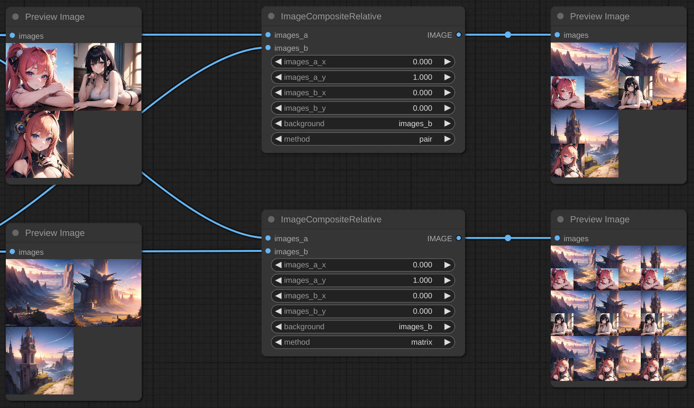
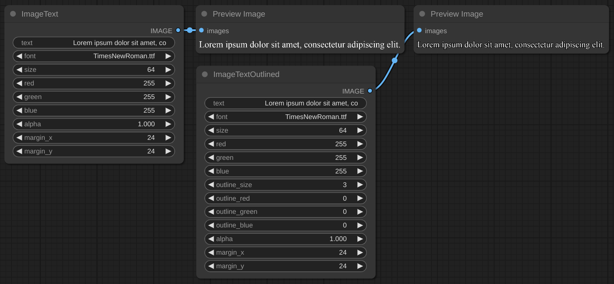
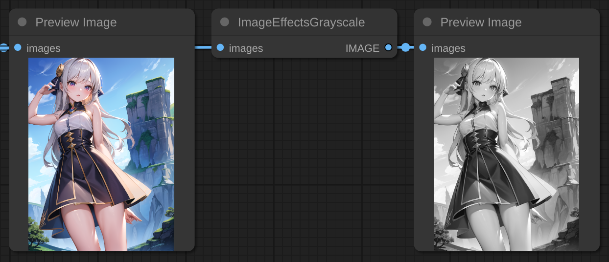
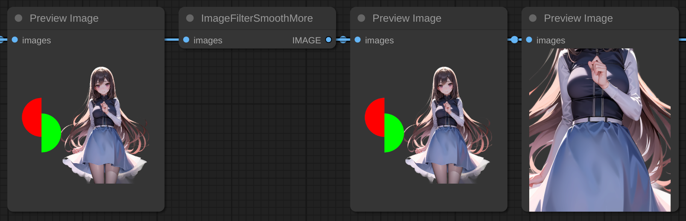
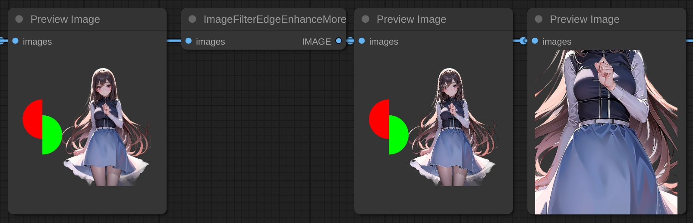
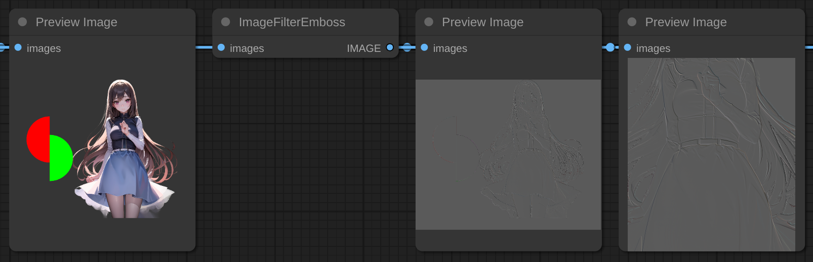
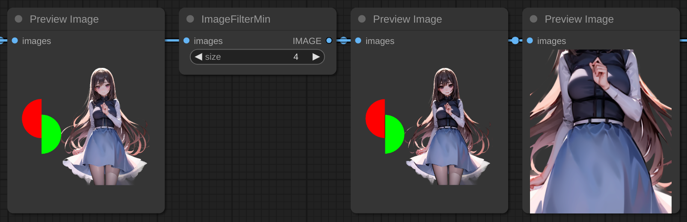

  
This image from start to end was done in ComfyUI. How?

1. Install plugin.
2. Load fonts [Overlock SC](https://fonts.google.com/specimen/Overlock+SC) and [Merienda](https://fonts.google.com/specimen/Merienda).
3. Put `OverlockSC-Regular.ttf` and `Merienda-Regular.ttf` in to `fonts` folder.
4. Load [RealESRNet_x4plus.pth](https://github.com/xinntao/Real-ESRGAN/releases/download/v0.1.1/RealESRNet_x4plus.pth) and put in to `models/upscale` folder.
5. Load [AOM3A1B_orangemixs.safetensors](https://huggingface.co/WarriorMama777/OrangeMixs/resolve/main/Models/AbyssOrangeMix3/AOM3A1B_orangemixs.safetensors) and put in to `models/chekpoints` folder.
6. Load [orangemix.vae.pt](https://huggingface.co/WarriorMama777/OrangeMixs/resolve/main/VAEs/orangemix.vae.pt) and put in to `models/vae` folder.
7. Drag-and-drop this [image](images/logo.png) to ComfyUI or load [JSON](images/logo.json).
8. Press the `Queue Promt` button.

## About Allor:
* Allor is a plugin for ComfyUI with an emphasis on transparency and performance.
* All modules support transparency, multi-image and are easy to use.
* One of the main features is the ability to combine several images of different sizes.
* Almost all functionality is implemented in tensor space without transformation into an image, where possible. This allows you to achieve an incredible speed of work, in some places the speed increases from 1-2 seconds to 4-6 milliseconds.

## Installation:
1. `cd custom_nodes`
2. `git clone https://github.com/Nourepide/ComfyUI-Allor.git comfyui_allor`
3. `cd comfyui_allor` 
4. `pip install -r requirements.txt`
5. You can also create `fonts` folder in `comfy_extras` or just start `ComfyUI` and folder will create automatically.

## Updating:
1. `cd custom_nodes/comfyui_allor` or `cd custom_nodes/{name of ComfyUI Allor folder}`
2. `git checkout main && git pull`

## Modules:
> Click on `Details` to open/close the drop-down menu with all modules.

  
Details: 👈

### Alpha chanel

> Helpers for work with alpha chanel in exiting images.

  
Nodes:

### Add

> Adds alpha chanel to images (Convert `RGB` to `RGBA`).

### Add By Mask

> Applies transparency to the images using a mask.

  
Params:

* method -
  * default - Standard mask overlay.
  * invert - Inverted mask overlay.

### As Mask

> Get alpha chanel from first images and returns it as mask.

  
Params:

* method -
  * default - Standard mask overlay.
  * invert - Inverted mask overlay.

### Restore

> Add alpha dimension to images. Or restore if it already exists. 

  
Params:

* method -
  * default - Apply adding new alpha chanel or restore chanel values to max if it already exists.
  * only_add - Only add new alpha chanel if it does not exist.
  * only_restore - Only restore alpha chanel values to max if it already exists.

### Remove

> Completely removes alpha chanel from images (Convert `RGBA` to `RGB`).

---
### Image Container

> Creating blank images of fixed or inherited size.

  
Nodes:

#### All
* [red, green, blue] `[0 - 255]` - Color of the container in RGB. 
* alpha `[0.0 - 1.0]` - Transparency of the container.

### Default
> Create an empty container.

  
Params:

* [width, height] `[1 - *]` - Size of a new container.

### Inheritance Add
> Get images size and create a container with adding value to this size.

  
Params:

* add_[width, height] `[0 - *]` - The value that will then be added to the size of the container.

### Inheritance Scale
> Get images size and create a container with scaling this size.

  
Params:

* scale_[width, height] `[0.0 - *]` - Scale factor that will then be change the size of the container.

### Inheritance Max
> Get max width and max height from `images_a` and `images_b` and create a new container with this size.
 
### Inheritance Sum
> Get width and/or height from `images_a` and `images_b` and create a new container with a sum this size.

#### PS:
The first letter `i` in the word `Inheritance` is barely noticeable. But in the end, I decided to leave it as it is. At first, I thought to replace this word with the word `Extended`, but one would think that this node expands the incoming images by adding size to it, and does not create a new image inheriting size from the incoming images.

---
### Image Composite

> Allows you to place one image on top of another.

  
Nodes:

#### All
* background - The placement order of images in the container.
* method - The method of connecting images makes sense only when 2 or more images are passed to the input.

  
Methods:

    Inputs - [a1, a2, a3] and [b1, b2, b3].
    Outputs -
        pair: [a1, b1], [a2, b2], [a3, b3]
        matrix: [a1, b1], [a1, b2], [a1, b3]
                [a2, b1], [a2, b2], [a2, b3]
                [a3, b1], [a3, b2], [a3, b3]

### Absolute
> Use it for pixel-perfect images compositing.

  
Params:

* images_[a, b]_x `[0 - *]` - Images horizontal position. `[left -> right]`.
* images_[a, b]_y `[0 - *]` - Images vertical position. `[top -> bottom]`.
* container_[width, height] `[0 - *]` - Container size. If 0, then the container will be with the maximum width and height of the images.

### AbsoluteByContainer
> Use it for pixel-perfect images compositing. The size of the container is taken from the outside.

  
Params:

* container - Image "donor". Its size will determine the size of the compositing space.
* images_[a, b]_x `[0 - *]` - Images horizontal position. `[left -> right]`.
* images_[a, b]_y `[0 - *]` - Images vertical position. `[top -> bottom]`.

### Relative
> Use it for percentage images compositing.

  
Params:

* images_[a, b]_x `[0.0 - 1.0]` - First images horizontal offset. `[left edge -> right edge]`.
* images_[a, b]_y `[0.0 - 1.0]` - First images vertical offset. `[top edge -> bottom edge]`.
* container_size_type
* * max - Maximum of width and height from `images_a` and `images_b`.
* * sum - Sum of width and height from `images_a` and `images_b`.
* * sum_[width, height] - Sum of width or height from `images_a` and `images_b`.

How it works.

* Images in relative mode cannot go beyond the edges of the container.
* In horizontal [0.0 - images is located on the left of the container], [1.0 - on right of container].
* In vertical [0.0 - images is located on the top of the container], [1.0 - on bottom of container].
* In all cases, [0.5] means that the images will be in the center.

### RelativeByContainer
> Use it for percentage images compositing. The size of the container is taken from the outside.

  
Params:

* container - Image "donor". Its size will determine the size of the compositing space. Can't be smaller then max size of with or height images_[a, b].
* images_[a, b]_x `[0.0 - 1.0]` - First images horizontal offset. `[left edge -> right edge]`.
* images_[a, b]_y `[0.0 - 1.0]` - First images vertical offset. `[top edge -> bottom edge]`.

---
### Image Segmentation

> Removes background from image.

  
Nodes:

#### All
* alpha_matting `[boolean]` - Alpha matting is a post-processing step that can be used to improve the quality of the output.
* alpha_matting_foreground_threshold `[0 - 250]` - Trimap foreground threshold.
* alpha_matting_background_threshold `[0 - 250]` - Trimap background threshold.
* alpha_matting_erode_size `[0 - *]` - How far will the transparency spread from the original mask.
* post_process_mask `[boolean]` - Post-processing mask, makes it rougher.

### Default
> Allows you to select a model with pre-specified settings.:

  
Params:

* u2net - [GitHub](https://github.com/xuebinqin/U-2-Net)
* u2netp - [GitHub](https://github.com/xuebinqin/U-2-Net)
* u2net_human_seg - [GitHub](https://github.com/xuebinqin/U-2-Net)
* u2net_cloth_seg - [GitHub](https://github.com/levindabhi/cloth-segmentation)
* silueta - [GitHub](https://github.com/xuebinqin/U-2-Net/issues/295)
* isnet-general-use - [GitHub](https://github.com/xuebinqin/DIS)
* isnetis - [GitHub](https://github.com/SkyTNT/anime-segmentation) (I recommend `alpha_matting` parameter set to `false`)
* modnet-p - [GitHub](https://github.com/ZHKKKe/MODNet) (Not calibrated)
* modnet-w - [GitHub](https://github.com/ZHKKKe/MODNet) (Not calibrated)

### Custom
> Allows you to select a model from the onnx folder and specify the parameters yourself.

  
Params:

* model `[*.onnx]` - Your model in `ComfyUI/models/onnx` folder.
* mean `[0.0 - 1.0]` - Clarifying value.
* std `[0.0 - 1.0]` - The divisor of the final value. I recommend leaving it at 1.0.
* size `[0 - *]` - Title size. Different models support different sizes. Or their multiple values [512 -> 1024 -> 2048...]. If the size does not match the desired one, you will see a notification in the console.

### Custom Advanced
> Allows you to select a model from the onnx folder and `finely` specify the parameters yourself.

  
Params:

* model `[*.onnx]` - Your model in `ComfyUI/models/onnx` folder.
* mean_r `[0.0 - 1.0]` - Clarifying value. Red chanel.
* mean_g `[0.0 - 1.0]` - Clarifying value. Green chanel.
* mean_b `[0.0 - 1.0]` - Clarifying value. Blue chanel.
* std_r `[0.0 - 1.0]` - The divisor of the final value. Red chanel.
* std_g `[0.0 - 1.0]` - The divisor of the final value. Green chanel.
* std_b `[0.0 - 1.0]` - The divisor of the final value. Blue chanel.
* width `[0 - *]` - Width of title size.
* height `[0 - *]` - Height of title size.

Some models support non-standard title size. For example [w:1024 - h:2048].

#### PS:
Made on [rembg](https://github.com/danielgatis/rembg). The solution of some problems may be dependent on the rembg developer.

---
### ImageText

> Creating text as image.

Fonts should be contained in `ComfyUI/comfy_extras/fonts`.

You also can change the fonts folder in config.

  
Nodes:

### Default

> Create an image with text.

  
Params:

* text - Your input. Shouldn't be empty.
* font `[*.otf, *.ttf]` - Font from `ComfyUI/comfy_extras/fonts` folder.
* size `[1 - *]` - Font size in `SP`. `Warning!`: It's not `PX` size of the container. The size of the container is calculated using a variety of parameters. Example: `o` and `j` will have different height and exactly different size compared to `树`.   
* [red, green, blue] `[0 - 255]` - Color of the text in `RGB`. 
* alpha `[0.0 - 1.0]` - Transparency of the text. 
* margin_x `[0 - *]` - Horizontal offset. 
* margin_y `[0 - *]` - Vertical offset.

### Outlined

> Create an image with outlined text.

  
Params:

* outline_size `[0 - *]` - Outline size in `PX`. 
* outline_[red, green, blue] `[0 - 255]` - Color of the outline in `RGB`. 

---
### ImageDraw

> Draw figures as image.

  
Nodes:

#### All
> All nodes has `ByContainer` version.
* SSAO [1 - 16] - [Super Sampling Anti-Aliasing](https://en.wikipedia.org/wiki/Supersampling). The figure is drawn initially at a higher resolution, and then compressed to the specified resolution.

  
The difference of SSAA strength:

> From left to right, x1, x2, x4, x8, x16. Image container size 256x256px.

### Arc

> Draws an arc (a portion of a circle outline) between the start and end angles, inside the given bounding box.

  
Params:

* [width, height] `[1 - *]` - Size of image container.
* size `[1 - *]` - contour width.
* start_[x, y] `[0.0 - 1.0]` - Start points to define the bounding box in percent of image container. 
* end_[x, y] `[0.0 - 1.0]` - End points to define the bounding box in percent of image container.
* [start, end] `[0 - 360]` - Starting and ending angle, in degrees. Angles are measured from 3 o’clock, increasing clockwise.
* [red, green, blue] `[0 - 255]` - Color of the figure in RGB. 
* alpha `[0.0 - 1.0]` - Transparency of the figure.

### Chord

> Same as Arc, but connects the end points with a straight line.

  
Params:

* [width, height] `[1 - *]` - Size of image container.
* size `[1 - *]` - contour width.
* start_[x, y] `[0.0 - 1.0]` - Start points to define the bounding box in percent of image container. 
* end_[x, y] `[0.0 - 1.0]` - End points to define the bounding box in percent of image container.
* [start, end] `[0 - 360]` - Starting and ending angle, in degrees. Angles are measured from 3 o’clock, increasing clockwise.
* [red, green, blue] `[0 - 255]` - Color of the figure in RGB. 
* alpha `[0.0 - 1.0]` - Transparency of the figure.

### Ellipse

> Draws an ellipse inside the given bounding box.

  
Params:

* [width, height] `[1 - *]` - Size of image container.
* start_[x, y] `[0.0 - 1.0]` - Start points to define the bounding box in percent of image container. 
* end_[x, y] `[0.0 - 1.0]` - End points to define the bounding box in percent of image container.
* outline_size `[0 - *]` - Outline size in PX.
* outline_[red, green, blue] `[0 - 255]` - Color of the outline in RGB. 
* outline_alpha `[0.0 - 1.0]` - Transparency of the outline.
* fill_[red, green, blue] `[0 - 255]` - Color of the fill in RGB. 
* fill_alpha `[0.0 - 1.0]` - Transparency of the fill.

### Line

> Draws a line between the coordinates.

  
Params:

* [width, height] `[1 - *]` - Size of image container.
* size `[1 - *]` - contour width.
* start_[x, y] `[0.0 - 1.0]` - Starting point of line. 
* end_[x, y] `[0.0 - 1.0]` - Ending point of line.
* [red, green, blue] `[0 - 255]` - Color of the line in RGB. 
* alpha `[0.0 - 1.0]` - Transparency of the line.

### Pieslice

> Same as Arc, but also draws straight lines between the end points and the center of the bounding box.

  
Params:

* [width, height] `[1 - *]` - Size of image container.
* start_[x, y] `[0.0 - 1.0]` - Start points to define the bounding box in percent of image container. 
* end_[x, y] `[0.0 - 1.0]` - End points to define the bounding box in percent of image container.
* [start, end] `[0 - 360]` - Starting and ending angle, in degrees. Angles are measured from 3 o’clock, increasing clockwise.
* outline_size `[0 - *]` - Outline size in PX.
* outline_[red, green, blue] `[0 - 255]` - Color of the outline in RGB. 
* outline_alpha `[0.0 - 1.0]` - Transparency of the outline.
* fill_[red, green, blue] `[0 - 255]` - Color of the fill in RGB. 
* fill_alpha `[0.0 - 1.0]` - Transparency of the fill.

### Rectangle

> Draws a rectangle.

  
Params:

* [width, height] `[1 - *]` - Size of image container.
* start_[x, y] `[0.0 - 1.0]` - Start points to define the bounding box in percent of image container. 
* end_[x, y] `[0.0 - 1.0]` - End points to define the bounding box in percent of image container.
* outline_size `[0 - *]` - Outline size in PX.
* outline_[red, green, blue] `[0 - 255]` - Color of the outline in RGB. 
* outline_alpha `[0.0 - 1.0]` - Transparency of the outline.
* fill_[red, green, blue] `[0 - 255]` - Color of the fill in RGB. 
* fill_alpha `[0.0 - 1.0]` - Transparency of the fill.

### Rectangle Rounded

> Draws a rounded rectangle.

  
Params:

* [width, height] `[1 - *]` - Size of image container.
* start_[x, y] `[0.0 - 1.0]` - Start points to define the bounding box in percent of image container. 
* end_[x, y] `[0.0 - 1.0]` - End points to define the bounding box in percent of image container.
* radius `[0 -360]` - Radius of the corners.
* outline_size `[0 - *]` - Outline size in PX.
* outline_[red, green, blue] `[0 - 255]` - Color of the outline in RGB. 
* outline_alpha `[0.0 - 1.0]` - Transparency of the outline.
* fill_[red, green, blue] `[0 - 255]` - Color of the fill in RGB. 
* fill_alpha `[0.0 - 1.0]` - Transparency of the fill.
* [top_left, top_right, bottom_right, bottom_left]_corner `[boolean]` - The ability to choose for which angle to apply the radius.

### Polygon

> Draws a polygon.

  
Params:

* size `[1 - *]` - Size of image.
* sides `[3 - *]` - Sides of polygon.
* rotation `[0 - 360]` - Apply an arbitrary rotation to the polygon in degree. 
* outline_size `[0 - *]` - Outline size in PX.
* outline_[red, green, blue] `[0 - 255]` - Color of the outline in RGB. 
* outline_alpha `[0.0 - 1.0]` - Transparency of the outline.
* fill_[red, green, blue] `[0 - 255]` - Color of the fill in RGB. 
* fill_alpha `[0.0 - 1.0]` - Transparency of the fill.

---
### Image Effects

> Apply effects to images.

  
Nodes:

### Adjustment

> Adjust your images with color correction.

  
Params:

* brightness `[0.0 - *]` - Adjust brightness of images with scale.
* contrast `[0.0 - *]` - Adjust contrast of images with scale.
* saturation `[0.0 - *]` - Adjust color saturation of an images with scale.
* hue `[0.0 - 1.0]` - Adjust hue of images.
* gamma `[0.0 - *]` - Perform gamma correction on an images with scale.
* sharpness  `[0.0 - *]` - Adjust the sharpness of an images with scale.
* [red, green, blue] - Scale color factor.

### Grayscale

> Turn your images into monochrome.

### Sepia

> Add an antique effect to your images.

### Negative

> Add negative effect.

### Lens Chromatic Aberration

> Apply a camera lens color shift to the images.

`Attention`⚡: You can test all params of `Chromatic Aberration` with this  [JSON](images/image_effects_chromatic_aberration.json). The example works using `Image Draw` module and does not require any preparation. Changing the parameters leads to very unusual effects that you will not find anywhere else, so I recommend that you spend time on this and get acquainted as best as possible for incredible results.

  
Params:

* shift `[0 - *]` - Color shift in PX.
* method `[reflect, edge, constant]` - Method for fill new empty space around image while effect applying. The new space does not fall into the final result and is only needed to avoid artifacts.
* shift_type `[1 - 4]` - Type of chromatic aberration.
* mixing_type `[1 - 4]` - Type of method for shifting colors.
* transpose `[none, rotate, reflect]` - Shifting direction, where `none` is without changes, `rotate` is in alternative direction and `reflect` in both directions at the same time.
* colors `[rb, rg, gb]`- The color layers that will be shifted. 
* lens_curvy `[0.0 - 15.0]` - The value of the curve during the propagation of the effect, where 1.0 is linear. Not work with shift_type 4.

  
lens_curvy in details:

  

### Lens Optic Axis

> Apply a camera lens distort to the images.

  
Params:

* lens_shape `[circle, square, rectangle, corners]` - Form of lens.

  
lens_shape in details:

  

* lens_edge `[around, symmetric]` - If `around` is selected, the lens will adjust to the proportions of the image.
* lens_curvy `[0.0 - 15.0]` - The value of the curve during the propagation of the effect, where 1.0 is linear.

  
lens_curvy in details:

  

* lens_zoom `[0 - *]` - How close lens are to the center of images.
* lens_aperture `[0 - *]` - How much lens will distort images.
* blur_intensity `[0.0 - *]` - Strength of blur due to lens.

### Lens Vignette

> Apply a camera lens decreasing in the brightness and saturation to the images.

  
Params:

* lens_shape `[circle, rectangle]` - Form of lens.

  
lens_shape in details:

  

* lens_edge `[around, symmetric]` - If `around` is selected, the lens will adjust to the proportions of the image.
* lens_curvy `[0.0 - 15.0]` - The value of the curve during the propagation of the effect, where 1.0 is linear.

  
lens_curvy in details:

  

* lens_zoom `[0 - *]` - How close lens are to the center of images.
* brightness `[0.0 - *]` - Adjust brightness of images with scale.
* saturation `[0.0 - *]` - Adjust color saturation of an images with scale.

---
### Image Filter

> Apply filters to images.

  
Nodes:

`Warning` Some changes are difficult to notice without detailed consideration.You can load this [JSON](images/image_filter.json) and look at the changes in detail.

### Smooth

> Anti-Aliasing of image artifacts.

### Smooth More

> Improved Anti-Aliasing of image artifacts.

### Blur

> Blurring the image.
 

  
Params:

* size_[x, y] `[1 - *]` - The strength of the blur application for horizontal and vertical direction.

### Box Blur

> Blurring the image by box algorithm.

  
Params:

* size_[x, y] `[1 - *]` - The strength of the blur application for horizontal and vertical direction.

### Gaussian Blur

> Blurring the image by gaussian algorithm.

  
Params:

#### All
* size_[x, y] `[1 - *]` - The strength of the blur application for horizontal and vertical direction.

#### Advanced
* sigma_[x, y] `[1 - *]` - The scale of the blur deviation.

### Stack Blur

> Blurring the image by stack algorithm.

  
Params:

* size_[x, y] `[1 - *]` - The strength of the blur application for horizontal and vertical direction.

### Median Blur

> Blurring the image by median algorithm.

  
Params:

* size_[x, y] `[1 - *]` - The strength of the blur application for horizontal and vertical direction.

### Bilateral Blur

> Blurring the image by bilateral algorithm. Keeps the image sharp at the edges.

  
Params:

* size_[x, y] `[1 - *]` - The strength of the blur application for horizontal and vertical direction.

### Contour

> Find the contours of the image.

### Detail

> Image detailing.

### Edge Enhance

> Clarity of the image boundaries.

### Edge Enhance More

> Improved clarity of image boundaries.

### Emboss

> Embossed image.

### Find Edges

> Identifies the boundaries of the image.

### Sharpen

> Sharpness improvement.

### Rank

> Rank filter sorts all pixels in a window of a given size.

  
Params:

* size `[0 - *]` - The size of the core in PX.
* rank `[0 - *]` - Which pixel value to choose.

### Min

> Selects the smallest pixel value in the window at the specified size.

  
Params:

* size `[0 - *]` - The size of the core in PX.

### Max

> Selects the largest pixel value in the window at the specified size.

  
Params:

* size `[0 - *]` - The size of the core in PX.

### Mode

> Selects the most common pixel value in a field of the specified size.

  
Params:

* size `[0 - *]` - The size of the core in PX.

---
### Image Transform

> Transform your images.

  
Nodes:

### Resize

> Change size of images.

  
Params:

#### Absolute
* [width, height] `[1 - *]` - New size of images.

#### Relative
* scale_[width, height] `[0.0 - 1.0]` - New size of images.

### Crop

> Returns area from images.

  
Params:

#### Absolute
* start_[x, y] `[1 - *]` - Start of rectangle point.
* end_[x, y] `[1 - *]` - End of rectangle point.

#### Relative
* start_[x, y] `[0.0 - 1.0]` - Start of rectangle point.
* end_[x, y] `[0.0 - 1.0]` - End of rectangle point.

### Crop Corners

> Round corners of your images.

  
Params:

* radius `[0 -360]` - Radius of the corners.
* [top_left, top_right, bottom_right, bottom_left]_corner `[boolean]` - The ability to choose for which angle to apply the radius.
* SSAO [1 - 16] - [Super Sampling Anti-Aliasing](https://en.wikipedia.org/wiki/Supersampling). The figure is drawn initially at a higher resolution, and then compressed to the specified resolution.

### Padding

> Expand your images.

### Rotate

> Rotate your images.

  
Params:

* angle `[0 -360]` - Angle in degrees. Angles are measured from 3 o’clock, increasing clockwise.
* expand `[boolean]` - If "true" when rotating, change the size of the image to fit into it.
* SSAO [1 - 16] - [Super Sampling Anti-Aliasing](https://en.wikipedia.org/wiki/Supersampling). The figure is drawn initially at a higher resolution, and then compressed to the specified resolution.

### Transpose

> Transpose your images.

---
### Clamp

> Clamps help to control the "web" of nodes and improve readability.

  
Nodes:

* ClipClamp
* ClipVisionClamp
* ClipVisionOutputClamp
* ConditioningClamp
* ControlNetClamp
* GligenClamp
* ImageClamp
* LatentClamp
* MaskClamp
* ModelClamp
* StyleModelClamp
* UpscaleModelClamp
* VaeClamp

## Configuration:
You can configurate Allor with `config.json`.
* fonts_folder_path - Array with a relative path to fonts folder, by default is `["comfy_extras", "fonts"]`. (Converted to `ComfyUI/comfy_extras/fonts` for Unix and `ComfyUI\comfy_extras\fonts` for Windows).
* modules - You can disable (or enable) modules at will. Nodes from disabled modules will not be loaded during the start of ComfyUI.
* override - If the nested value is set to `true`, similar functionality from the original nodes is disabled.
* * postprocessing - Disable `image/postprocessing` nodes. (See `ImageFilter` module)
* * transform - Disable `ImageScale` and `ImageInvert` nodes. (See `ImageTransform` module)

## Examples:

> Ready to create your own masterpiece?

  
Just see how easy it is to do:

`Warning` Google Collab can't reproduce those examples.

|            Image            |             Nodes              |
|:---------------------------:|:------------------------------:|
|  | [JSON](images/examples/1.json) |
|  | [JSON](images/examples/2.json) |

